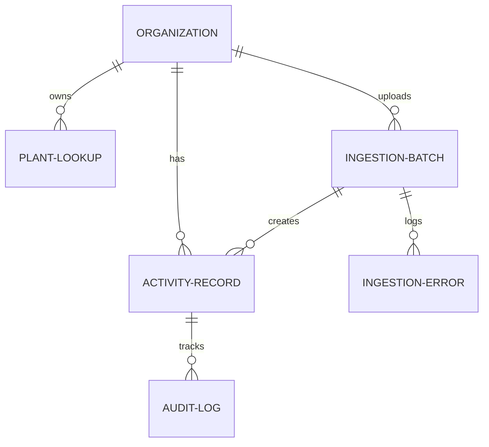

# ESG Data Model and Design Architecture

We built a data model in Django designed for extreme audit-readiness, speed, and strict multi-tenancy.

## Entity-Relationship Schema

---

## Model Descriptions and Architectural Decisions

### 1. Multi-Tenancy (`Organization`)
To support multi-tenancy, all customer-facing tables (`PlantLookup`, `IngestionBatch`, and `ActivityRecord`) have a foreign key pointing to `Organization`. Row-level queries are strictly filtered by this key, preventing any risk of cross-tenant data leaks. 

### 2. Source-of-Truth Tracking & Raw Data Preservation (`ActivityRecord.raw_data`)
A key auditor requirement is being able to trace any calculated value back to the raw source data.
To accomplish this:
- Every `ActivityRecord` maintains a `raw_data` `JSONField` storing the *exact* CSV row as it came in from the client (including German column headers, obscure codes, or trailing whitespaces).
- It also maintains a foreign key to `IngestionBatch`, tracking the specific file upload batch, the exact row index in that file (`source_row_index`), the upload timestamp, and the user who uploaded it.

### 3. Scope 1/2/3 Categorization
We store `scope` as a character choice field (`'1'`, `'2'`, `'3'`) with index markers to allow instant database filtering and aggregations.
- **Scope 1 (Direct)**: Diesel, Natural Gas, and Fuel Oil combustion.
- **Scope 2 (Indirect)**: Purchased electricity.
- **Scope 3 (Value Chain)**: Corporate business travel (Flights, Hotels, Ground Transport).

### 4. Unit Normalization & Recalculation Integrity
Rather than mutating raw values, we split them into distinct attributes:
- **Raw values**: `raw_quantity` (e.g. 100) and `raw_unit` (e.g. `GAL`).
- **Normalized values**: `normalized_quantity` (e.g. 378.541) and `normalized_unit` (e.g. `L`).
This makes the conversion path completely transparent. If an analyst manually corrects a quantity, our backend automatically references the standard carbon factors based on the `category` and recalculates the final `co2e_kg` in real-time.

### 5. Robust Audit Trail (`AuditLog`)
Every creation, edit, approval, or flag action triggers an entry in the `AuditLog` table. It captures:
- The user who executed the action.
- The action type (`CREATE`, `UPDATE`, `APPROVE`, `FLAG`, `REJECT`).
- A state diff stored inside `previous_values` and `new_values` JSON fields.
Once a record is `APPROVED`, `locked_for_audit` is set to `True`, preventing any further modifications or API writes to that row, satisfying strict compliance requirements.

### 6. Error & Partial Ingest Integrity (`IngestionError`)
In real deployments, an entire ingestion run shouldn't crash because of a single malformed row. Our ingestion engine isolates individual row failures, writes them to `IngestionError` with the raw content and error messages, and continues processing the rest of the file. The batch status is updated to `FAILED` if errors are present, alerting the analyst to review.
